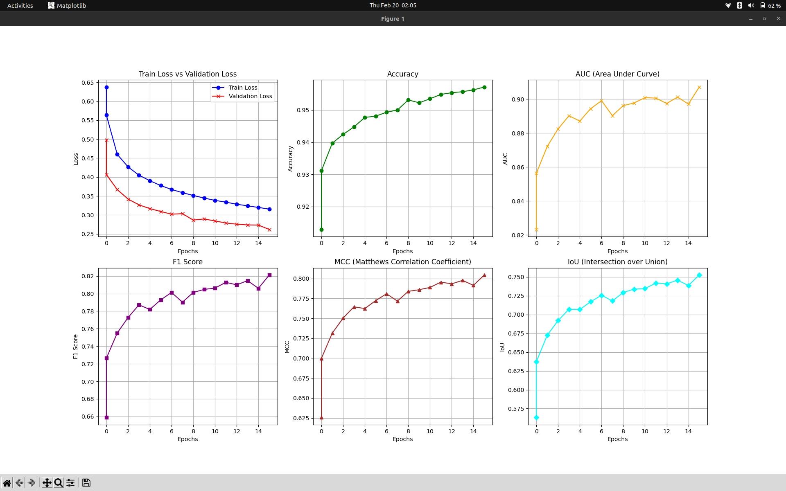

# Image Forgery Localization

## Overview
This project focuses on **image forgery localization** using deep learning techniques. The goal is to segment forged regions in an image using a **U-Net architecture** trained on various pre-trained encoders. The framework used for implementation is **PyTorch**.

## Framework & Architecture
- **Framework**: PyTorch  
- **Architecture**: U-Net for binary segmentation  
- **Encoders Used**:
  - EfficientNet-B0  
  - MobileNetV2  
  - MIT-B2 *(currently providing the best results)*  

## Performance Metrics
To evaluate the model performance, the following metrics were used:
- **Accuracy**
- **Matthews Correlation Coefficient (MCC)**
- **Intersection over Union (IoU)**
- **F1 Score**

### Model Performance Comparison:

## Inference & Test-Time Augmentation
- Test-time augmentation (TTA) is used during inference to improve predictions.  
- Inference results have been attached for comparison.  

### Model Inference Results:

## Future Improvements
- Exploring **Dual-Stream U-Net** and **Attention U-Net** to enhance performance.  
- Further optimizations in encoder selection and hyperparameter tuning.  

## Getting Started
### Installation
1. Clone the repository:
   bash
   git clone git@github.com:Manik1512/forgery-detectiono.git
   cd forgery-detectiono
